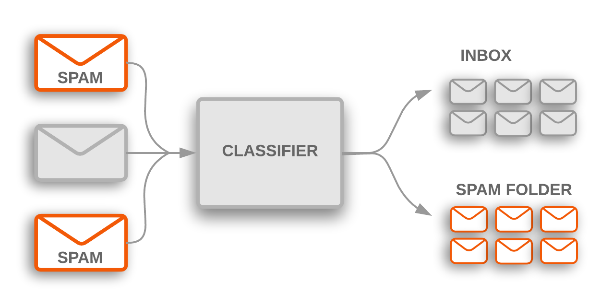

# Spam_Classifier

Used NLTK library for stemming and stopwords.
Stemming is used instead of Lemmatization as the messages data had short forms for many words, which demnstrates that instead of original words we had only the stem part of the word.
for example message data had "u" for "you"
which is clearly understanable for us buyt not for machine. So stemming was used to get the stem word. Stemming was imported from PorterStemmer present in porter module.

For the model - Naive Bayes classifier algorithm was used. 

This algorithm is most of the the time used for small cases, as it gives high accuracy.

The confusion matrix obtained is as below

Spam Classifier model, used Naive Bayes classifier and obtained accuracy of about 98percent
